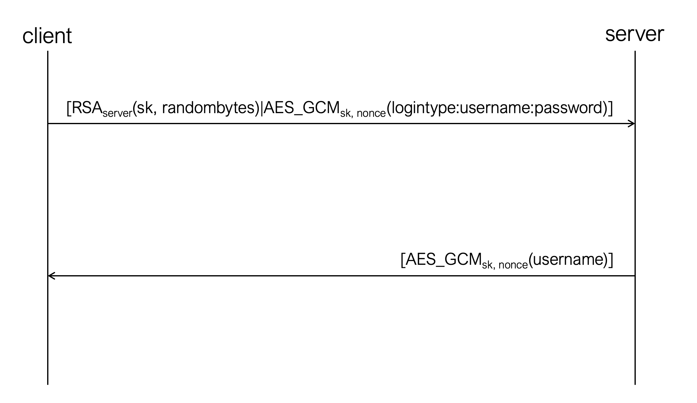
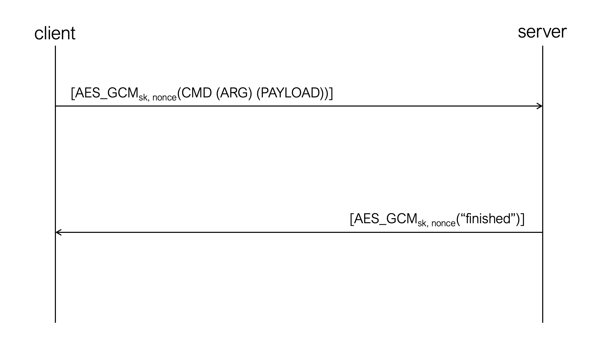

# Secure-FTP-Server
Final project for Applied Cryptography

## How to Use
*For easiest experience: navigate to the src folder and run network then server then client with no specifications for directories only use the -u flag to create a new user when running client for the first time*
#### 1. Run the Network
- `python3 network.py`
- flags (All args are optional.)
  - -n [path]: specifies the path to the network directory

#### 2. Run the Server
- `python3 server.py [flags]`
- flags: (All args are optional. Note that if -s serverRSA is left to default, it will first check the specified server directory, and if it cannot find the keys there will default to those in the src/example_server_keys directory.)
  - -s [path]: specifies the path to the server folder
  - -n [path]: specifies the path to the network directory
  - -r [path]: specifies the path to the directory containing the server RSA keys
  
#### 3. Run the Client
- `python3 client.py [flags]`
- flags (All args are optional unless you are a new user and must use -u. Note that if -s serverRSA is left to default, it will first check the specified server directory, and if it cannot find the keys there will default to those in the src/example_server_keys directory.)
  - -u: specifies that you are creating a new user folder on the server
  - -c [path]: specifies the directory of the client, this is where you can select files to upload and where files will be downloaded
  - -n [path]: specifies the network path, must be the same as the network path of the server
  - -r [path]: specifies the path/location of the server public RSA key, if left empty it will expect a file with the RSA key named serverRSApublic.pem to be located within the client directory

#### 4. When prompted, enter your username and password if you are a returning user. If you are a new user enter a username and a password of your choice. 

#### 5. Once the server responds with "Session established", you may interact with the server normally using any of the commands below. 

## Client Commands
#### Command Structure: cmd [args]
|Command|Description|Arguments|
|---|---|---|
|MKD|Creates a directory in the server-side working directory of the user|[Directory Name]|
|RMD|Deletes a directory in the server-side working directory if it exists|[Directory Name]|
|GWD|Returns the server working directory|None|
|LST|Lists the contents of the server working directory|None|
|UPL|Uploads an encrypted version of a file from the client-side directory|[File Name]|
|DNL|Downloads and decrypts a file from the server to the client-side directory|[File Name]|
|RMF|Deletes a file on the server-side working directory|[File Name]|
|end_session|Cleanly exits a session|None|

## Encryption Specifications
* Files are encrypted using AES in GCM mode and a key derived using scrypt and the password that the client enters as their file encryption/decryption password
* Messages are encrypted using AES in GCM mode and the key is prepended to the beginning of each session

**Key establishment protocol:** 
1. Client generates a session key of 16 random bytes and a sequence of 8 random bytes to be used as part of the cipher nonce 
2. The session key and random bytes are then encrypted with the server's public RSA key using PKCS1_OAEP 
3. The session nonce is established by appending an 8 byte counter to the end of the random bytes (nonce is incremented after sending or receiving a message to prevent replay)
4. The encrypted session key and random bytes are sent to the server in a hybrid message along with a login message in the form loginType:username:password encrypted with AES in GCM using the session key and session nonce
5. Server responds with the client's username encrypted with AES in GCM using the new session key and now-shared session nonce

**Client authentication:**
1. When the server recieves the initial message from the client containing the session key, username, password, etc. outlined in the diagram it will check if the loginType is newusr. If it is and there is no other user with the same username, the server creates a new user folder in the server directory named by the username. Inside the folder, the server will create a new file containing the user's password hashed with SHA256 and a root folder, with which the user will interact. Note: the user only has access to the files and directories that are below the root directory and cannot see their hashed password file.
2. If the message loginType is login, the server will hash the password with SHA256 and check against the hashed password file stored in the user's folder. The server authenticates the client by confirming the two hashes are equal. 
3. The server confirms authentication by sending the client their username encrypted in AES with the session key and nonce generated from the random bytes sent by the client. (server can only know these values if it successfully decrypts the RSA-encrypted first message from the client)

**Protocol for commands:**
* When the client enters a command, the command, arguments and payload are sent over encrypted with AES using the session key and an incremented nonce. 
* Ex: Client command in the format: 'mkd \<directory name\>' will be encrypted as 'mkd \<directory name\>' and sent to the server
* The server will always respond once the command has been received, parsed and operated on. The response can relate to a command or just be a simple confirmation of task accomplishment depending on the command issued by the client
  

**Storing sensitive data:**
* Hashed client passwords are stored on the server side in the user's folder (user does not have access to)
* Server stores its public key in a plaintext file
* Server stores its private key in a file encrypted with AES in GCM mode using a key derived from the server password
* The client's files on the server are encrypted using AES in GCM mode with a password derived key that is never sent to the server
